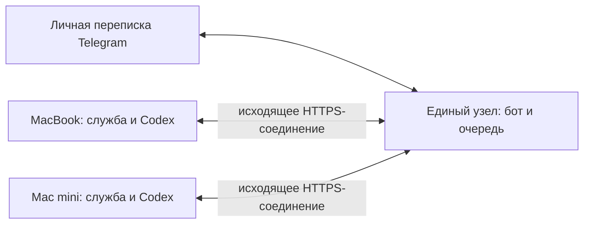

# Codex Telegram

Личная связь Telegram с Codex: уведомления с итогом, ответы в исходную задачу, доставка созданных PDF и изображений.

Выберите режим установки:

- [Один компьютер и один бот](#local-mode) — первоначальный режим, без отдельного сервера, домена и туннелей.
- [Один общий бот для нескольких компьютеров](#multi-computer-mode) — с единым узлом, распределяющим поручения.

**Версия 0.2.0.** Сценарий двух компьютеров проверен автоматически через настоящий локальный HTTP-сервер и независимые базы. Codex и Telegram в этих проверках заменены имитаторами. Связь с текущим настольным приложением, настоящим ботом и двумя физическими компьютерами ещё требует [сквозной проверки](docs/acceptance.md).

<a id="local-mode"></a>

## Первоначальный режим: один компьютер и один бот

На компьютере с Codex работает одна локальная программа. Она сама получает сообщения из Telegram и отправляет результаты через интернет. Адрес компьютера, отдельный сетевой сервер, сертификаты и туннели для этого режима не нужны.

Понадобятся Node.js 24 или новее, установленный Codex CLI и отдельный Telegram-бот. Программа должна иметь доступ к локальному серверу, который обслуживает исходные задачи Codex. Связь с текущим настольным приложением ещё требует проверки.

### 1. Установить программу

Если репозиторий ещё не скачан:

```sh
git clone git@github.com:Krivega/codex-telegram.git
cd codex-telegram
npm ci
```

Если проект уже есть на компьютере, откройте его каталог в терминале и выполните `npm ci`. Все дальнейшие команды выполняются из каталога проекта.

### 2. Подключить бота и локальный Codex

Создайте бота через `@BotFather` в Telegram и сохраните выданный токен для ввода в мастер. Узнать путь к установленному Codex можно командой:

```sh
command -v codex
```

Запустите настройку именно с `--role local`:

```sh
npm run setup -- --role local --home "$HOME/.config/codex-telegram-local"
```

Мастер попросит:

1. Токен бота. Ввод скрыт.
2. Подтвердить свой Telegram: открыть показанную ссылку и нажать «Запустить».
3. Путь к программе Codex. Вставьте результат `command -v codex`; абсолютный путь понадобится для автоматического запуска.
4. «Адрес локального сокета Codex». Это **путь на этом же компьютере**, через который программа обращается к Codex. По умолчанию предложен `~/.codex/app-server-control/app-server-control.sock`. Если вы не задавали другой путь, оставьте предложенное значение для последующей проверки.
5. Задачи: `all` для всех основных задач или их идентификаторы через запятую.
6. Интервал проверки. По умолчанию — пять секунд.

В примерах выбран отдельный каталог `$HOME/.config/codex-telegram-local`, чтобы не смешивать этот режим с настройками единого узла. Во всех командах используйте один и тот же `--home`. Настройки, токен и история сохраняются в этом каталоге; копировать их в репозиторий не нужно. Повторная настройка выполняется той же командой при остановленной программе.

### 3. Проверить подключение и запустить

Сначала выполните:

```sh
npm run doctor -- --home "$HOME/.config/codex-telegram-local"
```

Если проверка сообщает, что сокет не найден или нет открытой задачи, принимающей сообщения, связь с Codex ещё не готова. Нужно проверить доступ к серверу исходного приложения по разделу [«Подключение к настольному Codex»](#подключение-к-настольному-codex). Это локальная проблема подключения; адрес в интернете и туннель её не устраняют.

После успешной проверки запустите программу:

```sh
npm start -- --home "$HOME/.config/codex-telegram-local"
```

Для ручного запуска оставьте терминал открытым. Остановка — `Ctrl+C`. Компьютер должен оставаться включённым и подключённым к интернету; во время сна программа не работает.

### 4. Проверить переписку

В личном чате с ботом отправьте `/tasks`. Ответьте на сообщение нужной задачи коротким контрольным текстом и убедитесь, что он появился в той же задаче Codex. Затем выполните небольшое поручение в Codex и дождитесь уведомления о результате.

На уведомление можно ответить: «Сделай снимок страницы и пришли сюда» или «Подготовь PDF с результатами». Создание файлов зависит от инструментов и разрешений исходной задачи; порядок передачи описан в разделе [«Переписка и результаты»](#переписка-и-результаты).

В локальном режиме доступны `/tasks`, `/full`, `/status`, `/feedback текст` и `/help`. Команда `/full` отправляется ответом на уведомление и читает итог из локального Codex, поэтому требует работающей программы и доступного Codex. Команда `/hosts` относится только к режиму общего бота.

Посмотреть состояние и сохранённые замечания на компьютере:

```sh
node bin/codex-telegram.mjs status --home "$HOME/.config/codex-telegram-local"
node bin/codex-telegram.mjs feedback --home "$HOME/.config/codex-telegram-local"
```

### 5. Включить автоматический запуск на macOS

После успешной ручной проверки остановите программу через `Ctrl+C` и выполните:

```sh
node bin/codex-telegram.mjs service install --home "$HOME/.config/codex-telegram-local"
```

Будет установлена пользовательская служба `launchd`. Для этого в настройках должен быть абсолютный путь к Codex, полученный на втором шаге. Установка и восстановление после входа в систему ещё требуют проверки на вашем компьютере.

Отключить автоматический запуск, сохранив настройки и историю:

```sh
node bin/codex-telegram.mjs service uninstall --home "$HOME/.config/codex-telegram-local"
```

Для двух компьютеров этот режим можно настроить дважды, создав **отдельного бота для каждого**. Оба бота будут доступны в вашем Telegram в разных переписках. Один и тот же токен одновременно в двух локальных установках использовать нельзя. Для единой переписки предназначен следующий режим.

<a id="multi-computer-mode"></a>

## Как работает общий бот для нескольких компьютеров



Единый узел — единственный получатель сообщений бота. Каждое уведомление содержит название компьютера. Ответ на сообщение автоматически направляется по сохранённым идентификаторам компьютера и задачи. Названия задач могут совпадать. Отключённый компьютер получает свои поручения после восстановления связи; другой компьютер их не забирает.

Узел можно разместить на постоянно включённом компьютере или сервере. На нём не нужен Codex. Каждый компьютер с Codex устанавливает свою локальную службу и отдельный ключ. Входящие сетевые порты на этих компьютерах открывать не нужно. Один компьютер может одновременно обслуживать узел и локальный Codex — это две службы с разными каталогами настроек.

## Установка: один бот и два компьютера

На каждой машине нужны исходники и Node.js 24 или новее:

```sh
git clone git@github.com:Krivega/codex-telegram.git
cd codex-telegram
npm ci
```

На компьютерах с Codex дополнительно нужен CLI с `app-server proxy` и доступ к общему серверу, который обслуживает нужные задачи приложения. Наличие CLI само по себе не подтверждает такое подключение.

### 1. Настроить единый узел

Создайте отдельного бота через `@BotFather`. В каталоге проекта выполните:

```sh
npm run setup -- --role hub --home /absolute/path/codex-telegram-hub
npm run doctor -- --home /absolute/path/codex-telegram-hub
npm start -- --home /absolute/path/codex-telegram-hub
```

Мастер спросит токен, покажет одноразовую ссылку для привязки личного Telegram и предложит сетевые настройки. Токен вводится скрыто. Для удалённых компьютеров нужен HTTPS с доверенным сертификатом. Поддерживаются:

- встроенный TLS: указать пути сертификата и закрытого ключа;
- обратный прокси с HTTPS, например Caddy, перед локальным HTTP-портом;
- SSH-туннель: служба обращается к локальному адресу `http://127.0.0.1:8787`.

HTTP без шифрования разрешён только на локальном адресе. Примеры: [hub.config.example.json](examples/hub.config.example.json), [Caddyfile.example](examples/Caddyfile.example). Домен и сертификат настраиваются отдельно; программа не публикует сервер автоматически.

Для локальной проверки достаточно стандартного адреса `http://127.0.0.1:8787`. С другого компьютера такой адрес работает только при настроенном туннеле.

### 2. Подключить MacBook

В другом терминале единого узла выдайте код:

```sh
node bin/codex-telegram.mjs pair --name "MacBook" --home /absolute/path/codex-telegram-hub
```

Код действует пять минут и предназначен для одного компьютера. На MacBook:

```sh
npm run setup -- --role agent --home /absolute/path/codex-telegram-agent
npm run doctor -- --home /absolute/path/codex-telegram-agent
npm start -- --home /absolute/path/codex-telegram-agent
```

Мастер спросит адрес узла, код подключения, путь к Codex, сокет и выбранные задачи. Токен Telegram на компьютер не передаётся. Собственный случайный ключ сохраняется до запроса привязки: повтор после потерянного ответа использует ту же регистрацию.

Если привязка прервалась и код успел истечь, удалите `pending-pair.json` из каталога этой незавершённой установки, выдайте новый код и повторите настройку.

### 3. Подключить второй компьютер

На едином узле выполните `pair --name "Mac mini"` с тем же `--home`. На Mac mini повторите настройку роли `agent` с новым кодом. Не копируйте каталог состояния MacBook на работающий второй компьютер: у каждого должны быть собственные идентификатор, ключ и база.

В Telegram отправьте `/hosts`, затем `/tasks`. Ответьте на сообщение нужной задачи. Адресат выбирается автоматически для каждого ответа; переключать «текущий компьютер» не требуется.

## Переписка и результаты

После окончания выполнения приходит итоговый ответ Codex. Длинный текст сокращается до настроенного объёма; дополнительный пересказ моделью не выполняется. Завершения до первого запуска не рассылаются задним числом. Окончание ответа не означает независимую проверку выполнения всех требований.

Нажмите «Ответить» и напишите, например: «Сделай снимок мобильной версии и пришли сюда» или «Подготовь PDF с результатами и оставшимися вопросами». Поручение попадёт в исходную задачу. Для занятой задачи сохраняется порядок очереди.

Следующая таблица описывает режим общего бота. Доступные команды первоначального режима и его ограничения указаны в [инструкции локальной установки](#local-mode).

| Команда | Действие |
| --- | --- |
| `/hosts` | Названия компьютеров и состояние связи |
| `/tasks` | До 20 последних известных задач каждого подключённого компьютера |
| `/full` | Полный итог, ответом на уведомление; доступен и при отключённом компьютере |
| `/status` | Незавершённые поручения, адресаты и проблемные доставки узла |
| `/feedback текст` | Сохранить замечание на едином узле |
| `/help` | Подсказка |

Принимается только текст в личном чате владельца. Голосовые сообщения, входящие фотографии и группы не поддерживаются. Служба не подтверждает системные разрешения: при таком ожидании нужно открыть Codex.

Снимки и PDF создаёт Codex своими инструментами. Служба просит сохранять предназначенные для отправки копии в `<каталог компьютера>/artifacts/<поручение>` и записывать `manifest.json`:

```json
{
  "files": [
    { "path": "report.pdf", "name": "Отчёт.pdf" },
    { "path": "mobile.png", "name": "Мобильная версия.png" }
  ]
}
```

Проверяются границы каталога, размер, сигнатура формата и SHA-256. Передача через узел сохраняет исходные байты; PDF, PNG, JPEG и WebP отправляются документами. Ответ на сам документ также сохраняет компьютер и задачу. Обычные пути и ссылки из текста не загружаются. Проверка сигнатуры не заменяет проверку содержания и оформления.

## Подключение к настольному Codex

Используется `codex app-server proxy --sock PATH`. Служба не запускает отдельный сервер, не копирует историю и не создаёт задачу вместо исходной. Стандартный сокет: `$CODEX_HOME/app-server-control/app-server-control.sock`, обычно внутри `~/.codex`.

`doctor` проверяет историю и очередь. Для отправки нужна задача, уже загруженная тем же сервером и сообщающая `canAcceptDirectInput: true`. Сохранённую, но не открытую задачу нужно открыть в её исходном клиенте. Если сокет отсутствует, требуется выяснить доступный способ подключения именно вашей версии приложения. Запуск второго независимого сервера не доказывает связь с открытым окном.

Инструменты Codex и его разрешения должны позволять создавать результаты и записывать их в каталог поручения. Служба не расширяет доступ самостоятельно. Подробная процедура — в [docs/acceptance.md](docs/acceptance.md).

## Настройки и обслуживание

`setup` можно повторить при остановленной соответствующей службе. Для каждой роли используйте отдельный `--home`. Если аргумент не указан, каталог выбирается через `CODEX_TELEGRAM_HOME` либо стандартное место: `~/Library/Application Support/codex-telegram` на macOS, `$XDG_CONFIG_HOME/codex-telegram` на Linux, `%LOCALAPPDATA%/codex-telegram` на Windows.

| Параметр | По умолчанию |
| --- | --- |
| `codex.threadIds` на компьютере | `[]`: все основные задачи |
| `codex.pollIntervalMs` | 5000 мс |
| `offlineAfterMs` на узле | 60000 мс до отметки «нет связи» |
| `notifications.maxTextLength` | 3200 единиц UTF-16, без разрыва символов |
| `artifacts.maxFileBytes` | 20 МиБ на вложение |
| `artifacts.maxFiles` | 5 вложений на поручение |

Ограничения уведомлений и файлов копируются с узла при привязке компьютера. В дальнейшем редактируйте их в соответствующих настройках и перезапускайте службы; ограничение узла всегда применяется дополнительно. Каталог задач передаётся максимум для 1000 последних задач компьютера. В узле сохраняется полный итог до 1 МиБ; для большего ответа `/full` содержит явное указание открыть Codex.

`config.json` не содержит секретов. `secrets.json` содержит токен бота только на узле, а ключ компьютера — только в его установке. Узел хранит хеши ключей. Это разграничение доступа, а не шифрование локальной базы: там есть тексты поручений и ответов. На Unix личные файлы создаются с `0600`, каталоги с `0700`; на Windows нужно обеспечить доступ только владельцу средствами системы.

Команды обслуживания выполняются с соответствующим `--home`:

```sh
node bin/codex-telegram.mjs config --home /absolute/path/codex-telegram-hub
node bin/codex-telegram.mjs hosts --home /absolute/path/codex-telegram-hub
node bin/codex-telegram.mjs revoke --host HOST_ID --home /absolute/path/codex-telegram-hub
node bin/codex-telegram.mjs status --home /absolute/path/codex-telegram-agent
node bin/codex-telegram.mjs feedback --home /absolute/path/codex-telegram-hub
```

Отзыв ключа блокирует новые подключения, поручения и результаты этого компьютера. Уже полученные им поручения могут выполняться локально; для остановки нужно остановить службу на самом компьютере. Новая привязка получает новый идентификатор: старые сообщения не перенаправляются на неё автоматически.

### Автоматический запуск на macOS

После `doctor` и ручной проверки:

```sh
node bin/codex-telegram.mjs service install --home /absolute/path/codex-telegram-hub
node bin/codex-telegram.mjs service install --home /absolute/path/codex-telegram-agent
```

Команды выполняются на соответствующих машинах; при двух ролях на одной машине устанавливаются две службы `launchd`. Для компьютера задайте абсолютный `codex.executable`, который показывает `command -v codex`. Удаление: `service uninstall` с тем же `--home`. После перемещения проекта или смены Node.js переустановите службу. Узел должен оставаться включённым: его сон приостанавливает связь сразу со всеми компьютерами. Установка и запуск служб пока требуют отдельной проверки.

## Сбои, перенос и обновление

Поручения и результаты сохраняются в SQLite. Повтор сетевого сообщения между узлом и компьютером не создаёт второе поручение или уведомление: используются постоянные ключи событий и ревизии подтверждений. Неопределённый запрос Codex сверяется с его очередью и историей; отсутствие записи не считается доказательством отказа.

Telegram не даёт общей гарантии однократной отправки. При потере подтверждения доставка остаётся неопределённой и автоматически не повторяется. После проверки Telegram остановите службу узла и выполните:

```sh
node bin/codex-telegram.mjs retry --delivery 17 --confirm-duplicate-risk --home /absolute/path/codex-telegram-hub
```

Локальная команда `status` на компьютере показывает также отклонённые при передаче узлу файлы и события. Сетевые ошибки повторяются автоматически. Данные и вложения не удаляются автоматически; следите за местом на диске. После долгого отключения ещё не принятые сообщения ограничены сроком хранения Telegram.

Исходники можно переносить и передавать другим разработчикам отдельно от личных данных. Для нового компьютера выполняйте новую привязку. Для замены старого компьютера остановите его службу, сохраните весь каталог состояния и перенесите его вместе с самими задачами Codex и рабочими файлами; проверьте неизменность идентификаторов и исправьте локальные пути. Одна идентичность не должна одновременно работать на двух машинах. Перенос самих задач Codex программа не выполняет.

При переносе единого узла остановите старый, скопируйте **весь** каталог состояния и запустите только новую копию. База хранит адреса ответов, ключи и незавершённые поручения: её удаление теряет эти связи. Если изменился адрес узла, обновите `serverUrl` на компьютерах; `hubId` и ключи сохраняются. Текущие незавершённые вложения содержат абсолютные локальные пути: при переносе каталогов лучше сначала завершить их доставку.

**Переход с 0.1.0.** Старый `config.json` версии 1 и однокомпьютерный режим продолжают работать; новая установка такого режима доступна через `setup --role local`. Для общего бота остановите прежнюю службу и создайте отдельные каталоги узла и компьютера по инструкции выше. Старую базу не удаляйте. Автоматического переноса прежних привязок между ролями нет: старые уведомления не получат новые адреса. После перехода выберите задачу через новый `/tasks`.

## Разработка и обратная связь

```sh
npm ci
npm run check
```

Рабочих зависимостей нет: HTTP, TLS, криптография и SQLite предоставлены Node.js. TypeScript и типы закреплены в `package-lock.json`; SQLite в проверенной версии Node.js сообщает об экспериментальном статусе. Linux и Windows пока не проверены.

Замечания `/feedback` сохраняются локально и никому автоматически не отправляются. Перед выпуском версии просматривайте их командой `feedback`, дополняйте проверки и документируйте удачные сценарии. Архитектура: [docs/architecture.md](docs/architecture.md). Проверки: [docs/acceptance.md](docs/acceptance.md). План: [docs/plan.md](docs/plan.md).
